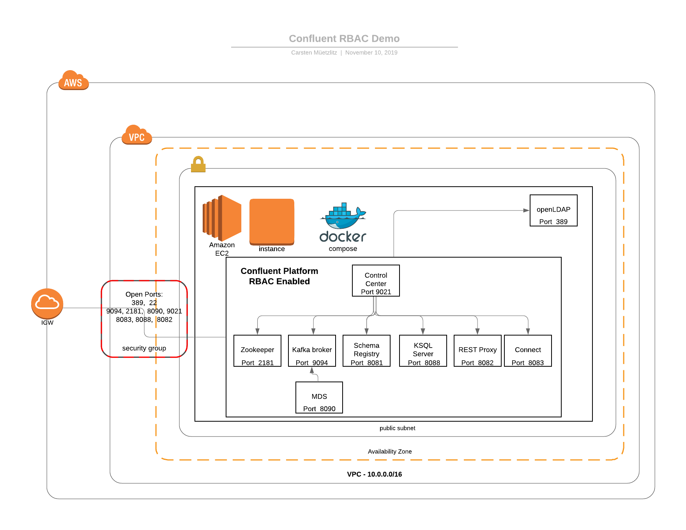
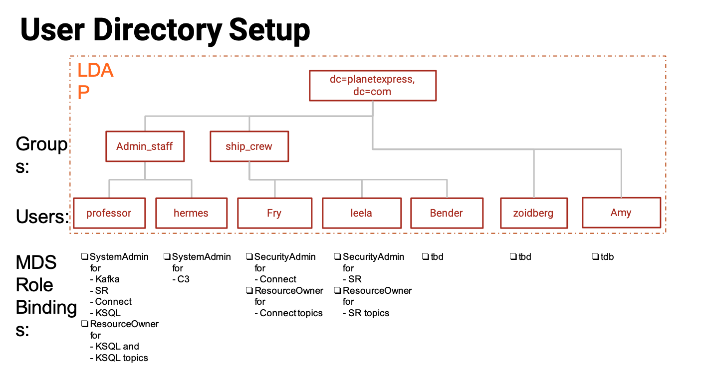

# Running RBAC on docker-compose in AWS

This docker-compose based setup includes:

- Zookeeper
- OpenLDAP
- Kafka with MDS, connected to the OpenLDAP
- Schema Registry
- KSQL
- Connect
- Rest Proxy
- C3
- install all utilities like jq, docker, expect, wget, unzip, java, ldap-tools



## Prerequisites

- create SSH key and deploy in AWS/Google, I use the key name `hackathon-temp-key`
---
The AWS Compute instance will everything prepare to run this demo, including
- docker
- Confluent Platform with all utilities installed
- `zookeeper-shell` must be on your `PATH`
- [Confluent CLI](https://docs.confluent.io/current/cli/index.html)
- VPCs and Security Group setup

### Optional
Install on your desktop Apache Directory Studio to create and modify LDAP users in openLDAP. [Download Apache Directory Studio](https://directory.apache.org/studio/downloads.html)
Apache Directory Studio is important if you want to add user/group in openLDAP or modify users or groups.

## Image Versions

We will use `PREFIX=confluentinc` and `TAG=5.3.1` for all images running via docker-compose. If you want to run newr docker images from Confluent, please change the `docker-compose.yml` file.


## Getting Started

---

To start confluent platform 5.3.1 including setup for RBC demo in AWS run

```
wget https://github.com/ora0600/confluent-rbac-demo/archive/master.zip
unzip master.zip
rm master.zip
cd confluent-rbac-demo-master/terraform/aws
terraform init
terraform plan
terraform apply
```
Terraform will deploy the complete environment and start all service via docker-compose.
The output of terraform will show you all the endpoints:
```
terraform output
C3 =  Control Center: http://pubip:9021
CONNECT =  Connect: curl http://pubip:8083
KAFKA =  --bootstrap-Server pubip:9094
KSQL =  ksql http://pubip:8088
LDAP =  ldapsearch -D "cn=Hubert J. Farnsworth" -w professor -p 389 -h pubip -b "dc=planetexpress,dc=com" -s sub "(objectclass=*)"
MDS =  confluent login --url  http://pubip:8090
REST =  REST Proxy: curl  http://pubip:8082
SR =  Schema Registry: curl  http://pubip:8081
SSH =  SSH  Access: ssh -i ~/keys/hackathon-temp-key.pem ec2-user@pubip 
ZOOKEEPER =  --zookeeper pubip:2181
```
It will take a while to configure and start every service in aws compute instance.

## login into compute instance
A AWS compute instance is created. You can login into AWS compute via
```
ssh -i hackathon-temp-key.epm ec2-user@PUBIP
```
The docker-compose project is `rbac`. docker-compose is after terraform deployment up and runnning.
You can use standard docker-compose commands like this listing all containers:
```
docker-compose -p rbac ps
```

or check logs:

```
docker-compose -p rbac logs ksql-server
docker-compose -p rbac logs control-center
```
If you work on the local aws compute instance via ssh then Kafka broker is available at `localhost:9094` (note, not 9092). All other services are at localhost with standard ports (e.g. C3 is 9021 etc).
In the AWS compute you can work with localhost, if you work from your local machine then please use the Public IP generated as output from terraform deployment

| Service         | Host:Port        |
| --------------- | ---------------- |
| Kafka           | `localhost:9094` |
| MDS             | `localhost:8090` |
| C3              | `localhost:9021` |
| Connect         | `localhost:8083` |
| KSQL            | `localhost:8088` |
| OpenLDAP        | `localhost:389`  |
| Schema Registry | `localhost:8081` |

If you are working remote from your machine, from where you deployed the aws compute then use the Public IP instead of localhost.

### Granted Rolebindings
Check LDAP Users in openLDAP:
```
ldapsearch -D "cn=Hubert J. Farnsworth,ou=people,dc=planetexpress,dc=com" -w professor -p 389 -h localhost -b "dc=planetexpress,dc=com" -s sub "(objectclass=*)"
```
Or open ApacheDirectory Studio and login as cn=admin,dc=planetexpress,dc=com with password GoodNewsEveryone

After Deployment the following setup is configured


We use the docker container for openLDAP. Please see the description [here](https://github.com/rroemhild/docker-test-openldap)

# Short Demo
Now check what is this deployment about:
Login into aws compute
```
ssh -i hackathon-temp-key.pem ec2-user@publicip
```

Start to list all role bindings. Login as SuperUser to MDS Service: 
```
# login as professor with password professor
confluent login --url http://localhost:8090
```

now list all rolebindings step by step
```
confluent iam rolebinding list --principal User:professor --kafka-cluster-id $KAFKA_ID 
confluent iam rolebinding list --principal User:professor --kafka-cluster-id $KAFKA_ID --ksql-cluster-id $KSQL_ID
confluent iam rolebinding list --principal User:hermes --kafka-cluster-id $KAFKA_ID
confluent iam rolebinding list --principal User:leela --kafka-cluster-id $KAFKA_ID --schema-registry-cluster-id $SR_ID
confluent iam rolebinding list --principal User:frey --kafka-cluster-id $KAFKA_ID --connect-cluster-id $CONNECT_ID
```

or use one command to list all (env variable $KAFKA_ID is already set in aws compute) rolebindings:
```
# check if env is set
echo $KAFKA_ID
for i in "professor" "hermes" "leela" "fry" "amy" "bender" "carsten"; do echo "confluent iam rolebinding list --principal User:${i} --kafka-cluster-id ${KAFKA_ID}"; confluent iam rolebinding list --principal User:${i} --kafka-cluster-id ${KAFKA_ID}; done
```

Create topic as user bender, first show configs property files:
Show client configs, which are prepared in aws compute:
```
cd /home/ec2-user/software/confluent-rbac-demo-master/rbac-docker/client-configs/
ls
cat professor.properties
cat bender.properties
```

Now, try to create a topic as user bender (should fail):
```
kafka-topics --bootstrap-server localhost:9094 --create --topic cmtest --partitions 1 --replication-factor 1 --command-config bender.properties
```
see error statement `[Authorization failed.]`

Try now as professor, he is the SuperUser:
```
kafka-topics --bootstrap-server localhost:9094 --create --topic cmtest --partitions 1 --replication-factor 1 --command-config professor.properties
kafka-topics --bootstrap-server localhost:9094 --list --command-config professor.properties
```

Try all the URLs as short demo :
  * go to control center as professor http://publicip:9021
  * logout try as Hermes, he is also SystemAdmin http://publicip :9021
  * He did not see CONNECT, KSQL and has no access to Schema Registry (Topic View)

Try Schema Registry
* as unauthoried user:
```
curl localhost:8081/subjects
```

* As Authroized User:
```
curl -u professor:professor localhost:8081/subjects
# Showed empty Schema
```

* try as anonymous user (is not configured):
```
curl -u ANONYMOUS localhost:8081/subjects
```

* and finally try as user frey
```
curl -u fry:fry localhost:8081/subjects
# Will show empty Schema
```

This was a short overview of configured RBAC environment.


# High level Hands-on with RBAC

First login into Compute instance on AWS
```
ssh -i ~/keys/hackathon-temp-key.pem ec2-user@pubip
cd software/confluent-rbac-demo-master/rbac-docker/client-configs/
```

Create Schema for CMTEST
```
curl -u professor:professor -X POST -H "Content-Type: application/vnd.schemaregistry.v1+json" --data '{"schema": "{\"type\":\"record\",\"name\":\"Payment\",\"namespace\":\"io.confluent.examples.clients.basicavro\",\"fields\":[{\"name\":\"id\",\"type\":\"string\"},{\"name\":\"amount\",\"type\":\"double\"}]}"}' http://localhost:8081/subjects/cmtest-value/versions
```

Get Schema from Schema Registry;
```
curl -u professor:professor localhost:8081/subjects
```

Check Schema also in C3 http://publicip:9021 as user professor. Go to topic cmtest and then Schema. Load data into cmtest2 topic and create it first
```
kafka-topics --bootstrap-server localhost:9094 --create --topic cmtest2 --partitions 1 --replication-factor 1 --command-config professor.properties
```

Now produce data into topic
```
kafka-console-producer --broker-list localhost:9094 \
--producer.config professor.properties --topic cmtest2 
# Enter
{"f1":"001"}
{"f1": "002"}
{"f1": "003"}
{"f1": "004"}
CTRL+c
```

Create SCHEMA for CMTEST2
```
curl -u professor:professor -X POST -H "Content-Type: application/vnd.schemaregistry.v1+json" --data '{"schema": "{\"type\":\"record\",\"name\":\"myrecord\",\"namespace\":\"io.confluent.examples.clients.basicavro\",\"fields\":[{\"name\":\"f1\",\"type\":\"string\"}]}"}' http://localhost:8081/subjects/cmtest2-value/versions
```

Get all Schemas
```
curl -u professor:professor localhost:8081/subjects
```

Get data of Schema for cmtest2
```
curl -u professor:professor localhost:8081/subjects/cmtest2-value/versions/latest
```
You may also check in C3 if you want.

Consume Data from CMTEST2 as professor
```
kafka-console-consumer --bootstrap-server localhost:9094 \
--consumer.config professor.properties --topic cmtest2 --from-beginning
```

Use KSQL cli and play aroud, first with fry (not allowed):
```
ksql -u fry -p fry http://localhost:8088
ksql> show topics;
ksql> print 'cmtest2' from beginning;
ksql> exit
```

Now, login as professor (Superuser)
```
ksql -u professor -p professor http://localhost:8088
ksql> show topics;
ksql> show streams;
ksql> CREATE STREAM JIMNEWTOPIC (MSG STRING) WITH (VALUE_FORMAT='DELIMITED', KAFKA_TOPIC='JIM-NEW-TOPIC', PARTITIONS=2, REPLICAS=1);
ksql> describe extended JIMNEWTOPIC;
ksql> SET 'auto.offset.reset'='earliest';
ksql> select * from JIMNEWTOPIC;
```

Open a second Terminal and produce data into topic JIMNEWTOPIC
```
kafka-console-producer --broker-list localhost:9094 --producer.config professor.properties --topic JIM-NEW-TOPIC
Hallo
Warum
Ist
das
so?
# enter CTRL+c to stop producing
```
The producer data should be visible in Terminal 1 (KSQL cli open select).

Now, enable user Bender for some specific work.
First Grant User:bender ResourceOwner to prefix Topic:foo on Kafka cluster KAFKA_ID:
```
confluent login --url http://localhost:8090 # as professor
confluent iam rolebinding create --principal User:bender --kafka-cluster-id $KAFKA_ID --role ResourceOwner --resource Topic:foo --prefix
```

List created rolebinding:
```
confluent iam rolebinding list --principal User:bender --kafka-cluster-id $KAFKA_ID
```

Create topic and produce data as bender:
```
kafka-topics --bootstrap-server localhost:9094 --create --topic foo.topic1 --partitions 1 --replication-factor 1 --command-config bender.properties
# List topic, should only list foo.topic1
kafka-topics --bootstrap-server localhost:9094 --list  --command-config bender.properties
# produce into topic
seq 1000 | kafka-console-producer --broker-list localhost:9094 --producer.config bender.properties --topic foo.topic1
```

Try to consume of topic as bender (shoudl fail):
```
kafka-console-consumer --bootstrap-server localhost:9094 \
--consumer.config bender.properties --topic foo.topic1 --from-beginning
```

There are some missing roles for bender, add them:
```
# READ Role
confluent iam rolebinding create \
--principal User:bender \
--role DeveloperRead \
--resource Topic:foo.topic1 \
--prefix \
--kafka-cluster-id $KAFKA_ID
```

Try again to consume
```
kafka-console-consumer --bootstrap-server localhost:9094 \
--consumer.config bender.properties --topic foo.topic1 --from-beginning
```

Still one role missing to access to consumer group, add: 
```
confluent iam rolebinding create \
--principal User:bender \
--role DeveloperRead \
--resource Group:console-consumer- \
--prefix \
--kafka-cluster-id $KAFKA_ID
```

Consume again, now should work
```
kafka-console-consumer --bootstrap-server localhost:9094 \
--consumer.config bender.properties --topic foo.topic1 --from-beginning
```

List roles for bender
```
confluent iam rolebinding list --principal User:bender --kafka-cluster-id $KAFKA_ID
```

Give Amy read access, but first go into Apache Directory and set password to amy,
or via ldap tools but is not working
```
ldappasswd -H ldap://localhost:389 -x -D "cn=admin,dc=planetexpress,dc=com" -W -S "uid=amy,ou=people,dc=planetexpress,dc=com"
# first amy, and amy
# then admin password is GoodNewsEveryone
```

Consume is not working:
```
kafka-console-consumer --bootstrap-server localhost:9094 \
--consumer.config amy.properties --topic foo.topic1 --from-beginning
```

Add missing roles to amy
```
# READ Role
confluent iam rolebinding create \
--principal User:amy \
--role DeveloperRead \
--resource Topic:foo.topic1 \
--prefix \
--kafka-cluster-id $KAFKA_ID
# access to consumer group
confluent iam rolebinding create \
--principal User:amy \
--role DeveloperRead \
--resource Group:console-consumer- \
--prefix \
--kafka-cluster-id $KAFKA_ID
```

List topics, if Amy is able to see something:
```
kafka-topics --bootstrap-server localhost:9094 --list  --command-config amy.properties
```

And now consume, should work
```
kafka-console-consumer --bootstrap-server localhost:9094 \
--consumer.config amy.properties --topic foo.topic1 --from-beginning
```

List roles of amy
```
confluent iam rolebinding list --principal User:amy --kafka-cluster-id $KAFKA_ID
```

Try ksql cli as bender:
```
ksql -u bender -p bender http://localhost:8088
ksql> show topics;
ksql> show streams;
ksql> exit
```

Start control center as Amy and check topics, ksql etc. http://pubip:9021

Delete AMy Access ON TOPIC
```
confluent iam rolebinding delete \
--principal User:amy \
--role DeveloperRead \
--resource Topic:foo.topic1 \
--prefix \
--kafka-cluster-id $KAFKA_ID
# DELETE amy access on consumer gloup
confluent iam rolebinding delete \
--principal User:amy \
--role DeveloperRead \
--resource Group:console-consumer- \
--prefix \
--kafka-cluster-id $KAFKA_ID
```

List roles of Amy
```
confluent iam rolebinding list --principal User:amy --kafka-cluster-id $KAFKA_ID
```

We have seen only user role assignments, now we would like to use groups, to make the live of an Admin easier:
1. Create new Group in LDAP, login in Apache Dorectory Studio as admin
    * create new user, , click on a existing user add new entry change cn carsten, change everything to doerte
    * create new group, click on a existing group add new entry change cn to ReadUsers member : uid=carsten

2. Now, assign roles and login as professor
```
confluent login --url http://localhost:8090
```

Assign read access to group ReadUsers
```
# READ Role
confluent iam rolebinding create \
--principal Group:ReadUsers \
--role DeveloperRead \
--resource Topic:foo.topic1 \
--prefix \
--kafka-cluster-id $KAFKA_ID
```

Assign role to consumer group
```
confluent iam rolebinding create \
--principal Group:ReadUsers \
--role DeveloperRead \
--resource Group:console-consumer- \
--prefix \
--kafka-cluster-id $KAFKA_ID
```

List roles for Group ReadUsers
```
confluent iam rolebinding list --principal Group:ReadUsers --kafka-cluster-id $KAFKA_ID
```

Check if now carsten can read via group role assigment
```
kafka-topics --bootstrap-server localhost:9094 --list  --command-config carsten.properties
```

And try to consume as carsten
```
kafka-console-consumer --bootstrap-server localhost:9094 \
--consumer.config carsten.properties --topic foo.topic1 --from-beginning
```

List roles of Carsten (list over role, will be derived)
```
confluent iam rolebinding list --principal User:carsten --kafka-cluster-id $KAFKA_ID
```

you should see
`     Principal    |     Role      | ResourceType |       Name        | PatternType  
+-----------------+---------------+--------------+-------------------+-------------+
  Group:ReadUsers | DeveloperRead | Group        | console-consumer- | PREFIXED     
  Group:ReadUsers | DeveloperRead | Topic        | foo.topic1        | PREFIXED     '

# Stop
Outside of aws compute, please use terraform, to really destroy the environment out of aws:
```
terraform destroy
```

If you inside aws compute you can stop the environment;
```
sudo -s
cd /home/ec2-user/software/confluent-rbac-demo-master/rbac-docker/
docker-compose -p rbac down
```

A restart inside the compute:
```
./confluent_start.sh
```

---
# Additional Information
Login to CLI as `professor:professor` as a super user to grant initial role bindings

```
# for running in cloud compute
confluent login --url http://localhost:8090
# for running on your local machine again cloud
confluent login --url http://pubip:8090
```

Set `KAFKA_CLUSTER_ID` in aws it is already prepared for you.

```
ZK_HOST=publicip:2181
KAFKA_CLUSTER_ID=$(zookeeper-shell $ZK_HOST get /cluster/id 2> /dev/null | grep version | jq -r .id)
```

Grant `User:bender` ResourceOwner to prefix `Topic:foo` on Kafka cluster `KAFKA_CLUSTER_ID`

```
confluent iam rolebinding create --principal User:bender --kafka-cluster-id $KAFKA_CLUSTER_ID --resource Topic:foo --prefix
```

List the roles of `User:bender` on Kafka cluster `KAFKA_CLUSTER_ID`
```
confluent iam rolebinding list --principal User:bender --kafka-cluster-id $KAFKA_CLUSTER_ID 
```

General Listing syntax
``` 
confluent iam rolebinding list User:[username] [clusters and resources you want to view their roles on]
```

General rolebinding syntax
```
confluent iam rolebinding create --role [role name] --principal User:[username] --resource [resource type]:[resource name] --[cluster type]-cluster-id [insert cluster id] 
```
available role types and permissions can be found [Here](https://docs.confluent.io/current/security/rbac/rbac-predefined-roles.html)
resource types include: Cluster, Group, Subject, Connector, TransactionalId, Topic

## Users and setup

---

| Description     | Name           | Role        |
| --------------- | -------------- | ----------- |
| Super User      | User:professor | SystemAdmin |
| Connect         | User:fry       | SystemAdmin |
| Schema Registry | User:leela     | SystemAdmin |
| KSQL            | User:professor | SystemAdmin |
| C3              | User:hermes    | SystemAdmin |
| Test User       | User:bender    | \<none>     |

- User `bender:bender` doesn't have any role bindings set up and can be used as a user under test
  - You can use `./client-configs/bender.properties` file to authenticate as `bender` from kafka console commands (like `kafka-console-producer`, `kafka-console-consumer`, `kafka-topics` and the like)
  - This file is also mounted into the broker docker container, so you can `docker-compose -p [project-name] exec broker /bin/bash` to open bash on broker and then use console commands with `/etc/client-configs/bender.properties`
  - When running console commands from inside the broker container, use `localhost:9092`
- All users have password which is the same as their user name, except `amy`. Her password I don't know, but it isn't `amy` :). So I usually connect to OpenLDAP via Apache Directory Studio and change her password to `amy`. Then use her as a second user under test.
