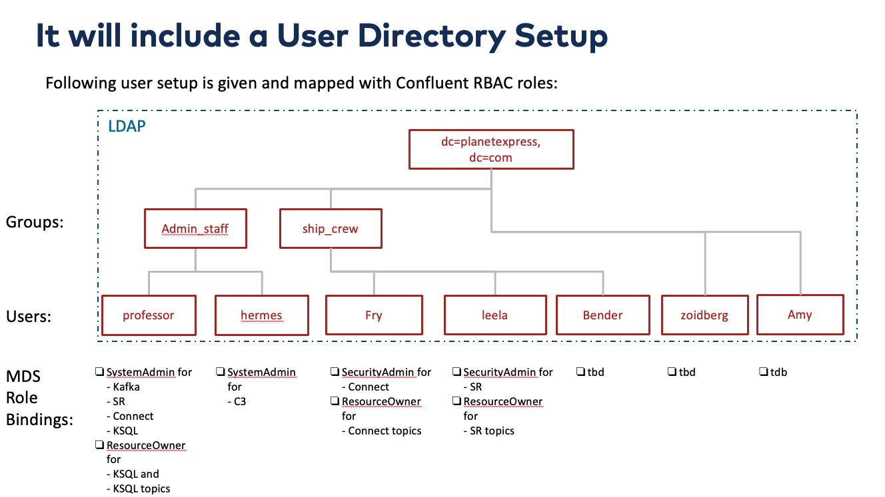
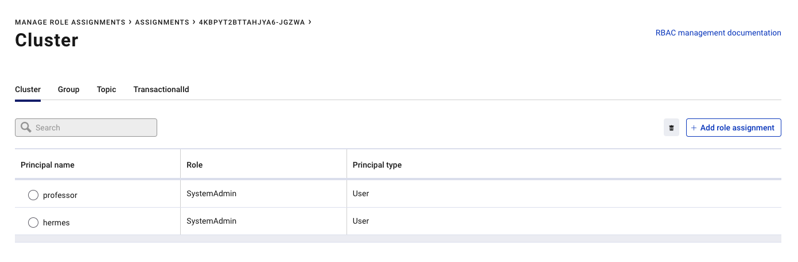

# Check the RBAC environment in Cloud
If the environment is started yet, please do so in cloud compuet instance:
The docker-compose project is `rbac`. 
```bash
ssh -i ~/keys/hackathon-temp-key.pem ec2-user@pubip
cd confluent-rbac-hands-on-master/rbac-docker
./confluent-start.sh
# set the IDs
export KAFKA_ID=$KAFKA_CLUSTER_ID ; export CONNECT_ID=$CONNECT ; export SR_ID=$SR ; export KSQL_ID=$KSQLSERVICEID" 
docker-compose -p rbac ps

```
or check logs:
```bash
docker-compose -p rbac logs ksql-server
docker-compose -p rbac logs control-center
```
Kafka broker is available at `localhost:9094` (note, not 9092). All other services are at localhost with standard ports (e.g. C3 is 9021 etc).

| Service         | Host:Port        |
| --------------- | ---------------- |
| Kafka           | `localhost:9094` |
| MDS             | `localhost:8090` |
| C3              | `localhost:9021` |
| Connect         | `localhost:8083` |
| KSQL            | `localhost:8088` |
| OpenLDAP        | `localhost:389`  |
| Schema Registry | `localhost:8081` |

If you are working remote from your machine, from where you deployed the aws compute then use the Public IP instead of localhost.

Add users and groups to OPenLDAP
```bash
docker exec -it openldap bash$ ldapadd -x -D "cn=admin,dc=planetexpress,dc=com" -w GoodNewsEveryone -H ldap:// -f /etc/add-user/add-user.ldif
```
Try to login into Confluent MDS service, use professor/professor
```bash
confluent login --url http://localhost:8090
```
Add Max to System Admin for Kafka
```bash
confluent iam rolebinding create \
    --principal User:max  \
    --role SystemAdmin \
    --kafka-cluster-id $KAFKA_CLUSTER_ID
```
Check LDAP Users in openLDAP:
```
ldapsearch -D "cn=Hubert J. Farnsworth,ou=people,dc=planetexpress,dc=com" -w professor -p 389 -h localhost -b "dc=planetexpress,dc=com" -s sub "(objectclass=*)"
```
Or open ApacheDirectory Studio and login as cn=admin,dc=planetexpress,dc=com with password GoodNewsEveryone
We use the docker container for openLDAP. Please see the description [here](https://github.com/rroemhild/docker-test-openldap)

After Deployment the following setup is configured


# Short Demo
Now check what is this deployment about:
Login into aws compute
```
ssh -i hackathon-temp-key.pem ec2-user@publicip
```
Start to list all role bindings. Login as SuperUser to MDS Service: 
```
# login as professor with password professor
confluent login --url http://localhost:8090
```
now list all rolebindings step by step
```
confluent iam rolebinding list --principal User:professor --kafka-cluster-id $KAFKA_ID 
confluent iam rolebinding list --principal User:professor --kafka-cluster-id $KAFKA_ID --ksql-cluster-id $KSQL_ID
confluent iam rolebinding list --principal User:hermes --kafka-cluster-id $KAFKA_ID
confluent iam rolebinding list --principal User:leela --kafka-cluster-id $KAFKA_ID --schema-registry-cluster-id $SR_ID
confluent iam rolebinding list --principal User:frey --kafka-cluster-id $KAFKA_ID --connect-cluster-id $CONNECT_ID
```
or use one command to list all (env variable $KAFKA_ID is already set in aws compute) rolebindings:
```
# check if env is set
echo $KAFKA_ID
for i in "professor" "hermes" "leela" "fry" "amy" "bender" "carsten"; do echo "confluent iam rolebinding list --principal User:${i} --kafka-cluster-id ${KAFKA_ID}"; confluent iam rolebinding list --principal User:${i} --kafka-cluster-id ${KAFKA_ID}; done
```
you can also check the security with Confluent Control Center. Use [http://pubip:9021](http://pubip:9021)


go back to [to Lab Overview](../Readme.md)